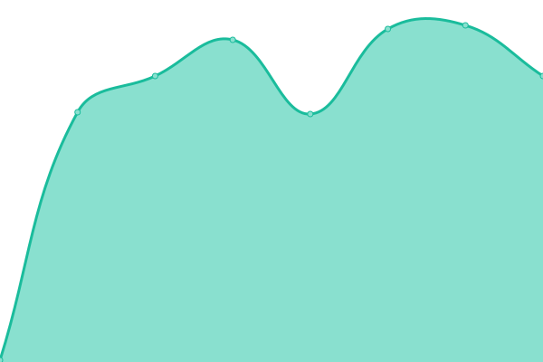

# [📈 Live Status](https://ADawidowski.github.io/upptime): <!--live status--> **🟩 All systems operational**

This repository contains the open-source uptime monitor and status page for [ADawidowski](https://ADawidowski.github.io/upptime), powered by [Upptime](https://github.com/upptime/upptime).

With [Upptime](https://upptime.js.org), you can get your own unlimited and free uptime monitor and status page, powered entirely by a GitHub repository. We use [Issues](https://github.com/ADawidowski/upptime/issues) as incident reports, [Actions](https://github.com/ADawidowski/upptime/actions) as uptime monitors, and [Pages](https://ADawidowski.github.io/upptime) for the status page.

<!--start: status pages-->
<!-- This summary is generated by Upptime (https://github.com/upptime/upptime) -->
<!-- Do not edit this manually, your changes will be overwritten -->
<!-- prettier-ignore -->
| URL | Status | History | Response Time | Uptime |
| --- | ------ | ------- | ------------- | ------ |
|  [WWW](https://oomkill.net) | 🟩 Up | [www.yml](https://github.com/ADawidowski/upptime/commits/HEAD/history/www.yml) | 

 1118ms
     
 | 

<a href="https://ADawidowski.github.io/upptime/history/www">100.00%</a>
    

|  [WebMail](https://mail.oomkill.net/rc) | 🟩 Up | [web-mail.yml](https://github.com/ADawidowski/upptime/commits/HEAD/history/web-mail.yml) | 

 1048ms
     
 | 

<a href="https://ADawidowski.github.io/upptime/history/web-mail">100.00%</a>
    

|  [SMTP](mail.oomkill.net) | 🟩 Up | [smtp.yml](https://github.com/ADawidowski/upptime/commits/HEAD/history/smtp.yml) | 

 147ms
     
 | 

<a href="https://ADawidowski.github.io/upptime/history/smtp">100.00%</a>
    

|  [IMAPS](mail.oomkill.net) | 🟩 Up | [imaps.yml](https://github.com/ADawidowski/upptime/commits/HEAD/history/imaps.yml) | 

 146ms
     
 | 

<a href="https://ADawidowski.github.io/upptime/history/imaps">100.00%</a>
    

|  [POP3S](mail.oomkill.net) | 🟩 Up | [pop-3-s.yml](https://github.com/ADawidowski/upptime/commits/HEAD/history/pop-3-s.yml) | 

 148ms
     
 | 

<a href="https://ADawidowski.github.io/upptime/history/pop-3-s">100.00%</a>
    

<!--end: status pages-->

[**Visit our status website →**](https://ADawidowski.github.io/upptime)

## 📄 License

- Powered by: [Upptime](https://github.com/upptime/upptime)
- Code: [MIT](./LICENSE) © [Anand Chowdhary](https://anandchowdhary.com), supported by [Pabio](https://pabio.com)
- Data in the `./history` directory: [Open Database License](https://opendatacommons.org/licenses/odbl/1-0/)
